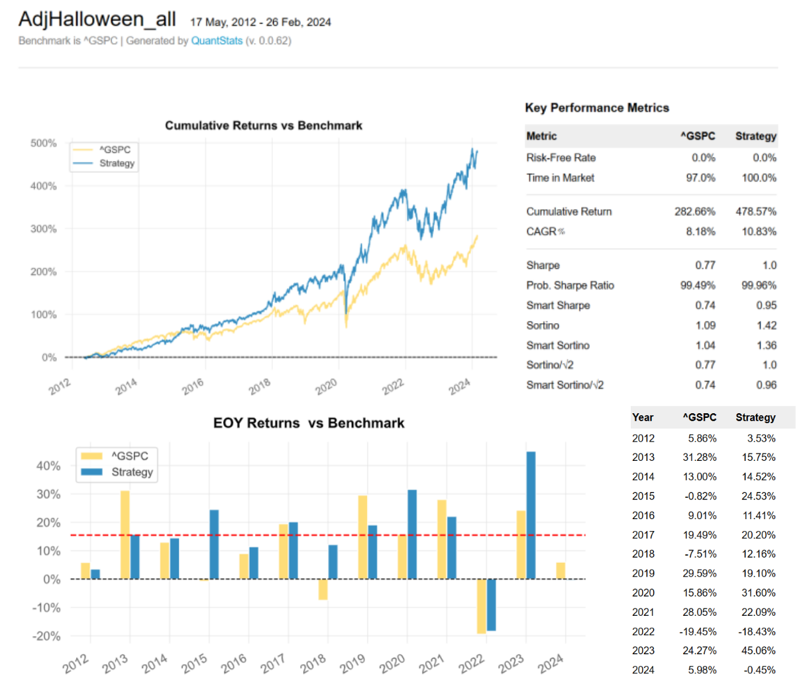

# ChesleyAlgo: Robo-Advisor algorithm using seasonality strategy

This algorithm puruses a strategy of following the stock market direction and presents portfolio according to investor's risk tolerance and market condition. The goal of this Robo-advisor algorithm is providing optimal portfolio suitable for investor's propensity while achieving returns exceeding the benchmark S&P500 index.

## Asset allocation & User profile

## Backtesting Result

   

## Credit
**Eugene Park** [Github](https://github.com/parkakn){:target="_blank"}, [Linkedin](https://www.linkedin.com/in/eugene-park-){:target="_blank"}

